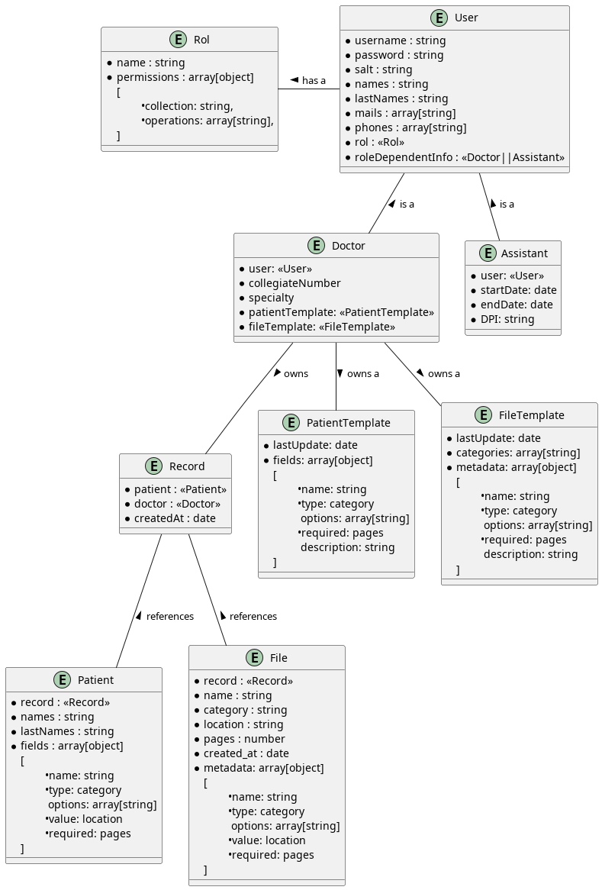

# Database

The App uses Mongo DB as database. Following is the squema design and relation between documents. But first some notation convantions:

### Notation

1. **Required Fields** : When an field is obligatory, is preceded by ` • `. Ex: `• name`

2. **Foreign Keys**: Are references to documents of other collections. Are denoted as `<<CollectionName>>`. Ex: `<<Rol>>`

3. **Embed Document and Arrays of Documents**: Are denoted as :
   
   ```javascript
   <fieldName> : object
   {
      childAttribute : type
   }
   
   --- ex: 
   family : object
   {
      dad : string,
      mother : string
   ```

## DB Schema Diagram



## Fields Dictionary

Below is a a list of examples of the JSON that is expected to be stored in each collection

<details>
  <summary><b>Rol</b></summary>
  ```javascript
   {
      name: "Admin",
      permissions: ["CREATE", "READ","UPDATE", "DELETE"]
  }
  ```
</details>
